<p align="center">
  
</p>

```python
# proof-of-concept — patches faster than it can be exploited
class SecurityEngineer:
    handle    = "bga"
    languages = {"spoken": ["tig", "en", "nl"], "code": ["python", "php", "bash"]}
    focus     = ["CVE triage & remediation", "patch backporting", "AI-assisted security tooling"]

    stack = {
        "security": ["NVD", "CVE triage", "patch diffing", "backporting"],
        "backend":  ["Python", "FastAPI", "PHP"],
        "ai":       ["LLM pipelines", "agent architectures", "MCP"],
    }

    def disclose(self) -> str:
        return "ship the patch before someone ships the exploit"


assert SecurityEngineer().disclose()  # > responsibly, always
```

```
remediation timeline
  ├─ T+0h   advisory ingested from NVD feed
  ├─ T+2h   root cause isolated · patch diffed
  ├─ T+6h   fix backported across affected branches
  └─ T+24h  shipped · window closed
```

---

<sub>🔒 disclosed responsibly &nbsp;·&nbsp; 📍 Netherlands &nbsp;·&nbsp; 🐦 [@bgatwitt](https://twitter.com/bgatwitt)</sub>
